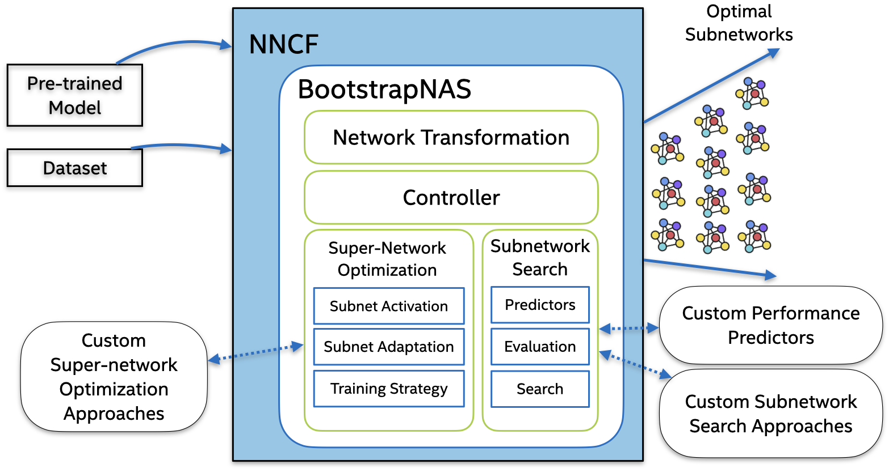

# Intel's BootstrapNAS MLPerf Submission

This is the repository of Intel's BootstrapNAS submission for [MLPerf Inference Benchmark v2.0](https://www.mlperf.org/inference-overview/).

## BootstrapNAS 
BootstrapNAS is a modular, multi-stage software AI automation capability that takes as input a pre-trained DL model, internally it automatically generates a super-network, and performs a Neural Architecture Search (NAS), producing as result, a set of efficient ready-to-deploy models that outperform the original model in terms of either accuracy, performance, or both objectives for the underlying target hardware platform. This capability is under development and will soon be open sourced.

<p align="center">

</p>

```BibTex
@article{DBLP:journals/corr/abs-2112-10878,
  author    = {J. Pablo Muñoz and Nikolay Lyalyushkin and Yash Akhauri and Anastasia Senina and
               Alexander Kozlov and Nilesh Jain},
  title     = {Enabling NAS with Automated Super-Network Generation},
  journal   = {CoRR},
  volume    = {abs/2112.10878},
  year      = {2021},
  url       = {https://arxiv.org/abs/2112.10878},
  eprinttype = {arXiv},
  eprint    = {2112.10878},
  timestamp = {Tue, 04 Jan 2022 15:59:27 +0100},
  biburl    = {https://dblp.org/rec/journals/corr/abs-2112-10878.bib},
  bibsource = {dblp computer science bibliography, https://dblp.org}
}
```

## Benchmark
***BootstrapNAS can achieve up to 2.55x improvement for the pre-trained PyTorch Torchvision Resnet-50 (INT8) model.***

BootstrapNAS provides up to 2.55x boost in comparison with the [PyTorch Torchvision ResNet-50 model](https://pytorch.org/vision/stable/_modules/torchvision/models/resnet.html#resnet50) ([pth](https://download.pytorch.org/models/resnet50-0676ba61.pth)) which was quantized using previous [MLPerf v1.1 instructions](https://github.com/mlcommons/inference_results_v1.1/tree/main/closed/Intel/calibration/resnet50/openvino-cpu).  The FP32 pre-trained Torchvision model was used as input to generate the BootstrapNAS models for this submission. More details in [calibration.md](calibration.md).

Our MLPerf Inference v2.0 submission contains the following:

| Benchmark      | % of Torchvision FP32 Accuracy | Scenarios |
|:--------------:|:------:|:---------------:|
| BootstrapNAS A | 98.53  | Offline, Server |
| BootstrapNAS B | 100.20 | Offline, Server |
| BootstrapNAS C | 99.66  | Offline, Server |

The benchmark is stored in the [code/resnet50/](code/resnet50) directory which contains a `README.md` detailing instructions on how to set up the benchmark. The benchmark was evaluated using a server with two Intel(R) Xeon(R) Platinum 8380 (IceLake) CPUs with 40 cores.


***Summary:***

| Benchmark      | Top-1 Accuracy [%] | Server Throughput [queries/sec]  |  Offline Throughput [samples/sec]  |
|:----------------:|:------:|:-------:|:--------:|
| Torchvision RN50 | 75.714	| 3347.57	| 4181.64  |
| BootstrapNAS A   | 74.894	| 8242.91 | 10679.00 |
| BootstrapNAS B   | 76.166	| 5041.17 | 5999.10  |
| BootstrapNAS C   | 75.752	| 6597.48 | 7916.33  |

